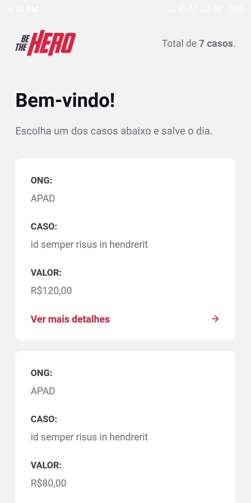
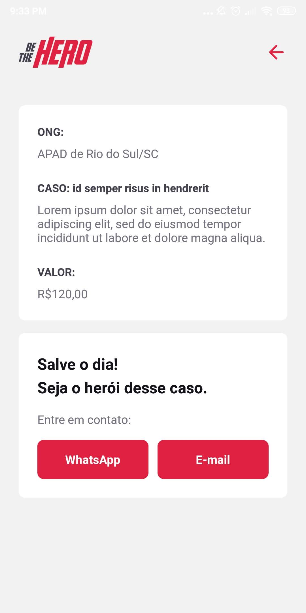

<h4 align="center">
<br> 
</h4>

<p align="center">
  

  
  
  
  
  
    

  
</p>

## 💻 Project

Be The Hero is a project that aims to connect people who are willing to help NPOs.

<h1 align="center">
    
</h1>

<h1 align="center">
    
    
    
</h1>

## :rocket: Technologies

This project was developed with the following technologies:

- [Node.js](https://nodejs.org/en/)
- [React](https://reactjs.org)
- [React Native](https://facebook.github.io/react-native/)
- [Expo](https://expo.io/)

Extras:

- Main Libs
  - [Express](https://expressjs.com/pt-br/)
  - [KnexJS](http://knexjs.org/)
- Estilos
  - [EditorConfig](https://editorconfig.org/)
  - [ESLint](https://eslint.org/)
  - [Prettier](https://prettier.io/)

### 🧭 Rodando o Backend

```bash
# Clone este repositório
$ git clone https://github.com/mschneider86/be-the-hero

# Acesse a pasta do projeto no terminal/cmd
$ cd be-the-hero

# Vá para a pasta Backend
$ cd backend

# Instale as dependências
$ npm install ou yarn add

# Execute a aplicação em modo de desenvolvimento
$ npm run dev ou yarn dev

# O servidor inciará na porta:3333 - acesse http://localhost:3333
```

### 🧭 Rodando o Frontend

```bash
# Clone este repositório
$ git clone https://github.com/mschneider86/be-the-hero

# Acesse a pasta do projeto no seu terminal/cmd
$ cd be-the-hero

# Vá para a pasta da aplicação Frontend
$ cd frontend

# Instale as dependências
$ npm install ou yarn add

# Execute a aplicação
$ npm start ou yarn start

# A aplicação será aberta na porta:3000 - acesse http://localhost:3000
```

### 🧭 Rodando o Mobile

```bash
# Clone este repositório
$ git clone https://github.com/mschneider86/be-the-hero

# Acesse a pasta do projeto no seu terminal/cmd
$ cd be-the-hero

# Vá para a pasta da aplicação Mobile
$ cd mobile

# Instale as dependências
$ npm install ou yarn add

# Execute a aplicação
$ expo start

```

## 🤔 How to contribute

- Fork this repo;
- Create a branch with your feature: 'git checkout -b my-feature';
- Commit your changes: `git commit -m 'feat: My new feature'`;
- Push to your branch: 'git push origin my-feature'.
